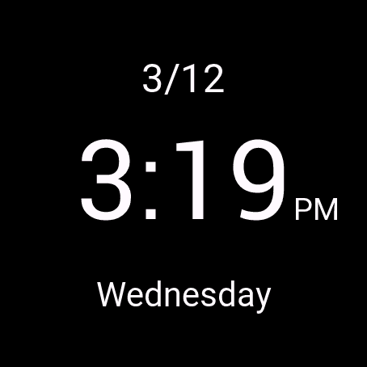

# Simple Garmin Watch Face

A simple watch face for Garmin devices. Displays time in 12-hour format with AM/PM indicator, current date with day of the week

## Development
To work on this project:
1. Open the `code/` folder in VSCode - not the root repository folder
2. Run "Run Without Debug" to see the watch face in the simulator
3. The simulator cannot be launched from the root of the repository

## Installation
1. Find the .prg file you want in the `builds/` folder
2. Connect your Garmin device to your computer
3. Copy the .prg file to the `/GARMIN/APPS/` directory on your device
4. Disconnect your device and select the watch face

## Builds
The `builds/` folder contains different versions of the watch face. Just select the .prg file you want and install it as described above.

___

The screenshot shows the appearance of the v01 build of the watch face.